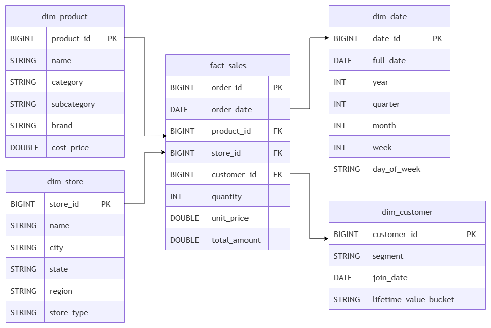

# Retail Lakehouse Migration & Conversational Query Assistant

A conversational AI agent that translates natural language into SQL queries against an Apache Iceberg lakehouse, with time travel, partition pruning, schema evolution, column-level masking, and full audit logging.

---

## Acceptance Criteria

### 1. Date-Range Querying

Asking the agent for data within a specific date range returns only that range, not a full table scan.


### 2. Time Travel Proof

Iceberg records every write as an immutable snapshot. The same query against two different snapshots returns different results — proving real historical state is preserved.

```bash
docker compose exec backend python -m spark_jobs.time_travel
```

```
=== SNAPSHOT HISTORY BEFORE CHANGE ===
+-------------------+-----------------------+
|snapshot_id        |committed_at           |
+-------------------+-----------------------+
|3873399174301443112|2026-07-15 09:17:20.833|
+-------------------+-----------------------+

SNAP_BEFORE=3873399174301443112
Inserted order_id=8888888 with discount_pct=0.05
SNAP_AFTER=5137975962802803442

=== CURRENT (latest snapshot) ===
+---------+-------------------+
|row_count|              total|
+---------+-------------------+
|  1200001|1.665838790520001E9|
+---------+-------------------+

=== AS OF SNAP_BEFORE (snapshot 3873399174301443112) ===
+---------+--------------------+
|row_count|               total|
+---------+--------------------+
|  1200000|1.6658386905300007E9|
+---------+--------------------+

=== AS OF TIMESTAMP 2026-07-15 09:17:20.833000 ===
+---------+
|row_count|
+---------+
|  1200000|
+---------+
```

The extra row and total difference prove that `VERSION AS OF` and `TIMESTAMP AS OF` resolve to consistent historical state.


### 3. Partition Pruning Proof

`fact_sales` is partitioned by `days(order_date)`. A date-filtered query prunes from 730 files down to 31 — only 4% of the table scanned.

```bash
docker compose exec backend python -m spark_jobs.prove_pruning
```

**Full scan** — no filter, reads every partition:
```
BatchScan nessie.retail.fact_sales[total_amount#7] ... [filters=, groupedBy=]
```

**Pruned scan** — January 2024 filter pushed down to file level:
```
BatchScan nessie.retail.fact_sales[order_date#20, total_amount#26] ...
[filters=order_date IS NOT NULL, order_date >= 19723, order_date <= 19753, groupedBy=]
```

**File counts from Iceberg metadata:**

| Query                  | Files touched |
|------------------------|---------------|
| Full scan (no filter)  | 730           |
| Pruned (Jan 2024 only) | 31            |

---

## Directory Structure (Git-Tracked)

```
retail_lakehouse_migration_and_conversational_query_assistant/
├── agent/
│   ├── audit.py                    # Persists every interaction to Iceberg audit_log
│   ├── memory.py                   # Redis-backed conversation history (10 turns, 1h TTL)
│   └── tools/
│       ├── lakehouse_query.py      # Primary SQL execution tool + system prompt
│       ├── time_travel.py          # VERSION AS OF / TIMESTAMP AS OF queries
│       ├── explain_query.py        # EXPLAIN EXTENDED plan analysis
│       ├── commit_conflict.py      # Iceberg optimistic concurrency conflict retrieval
│       └── audit_query.py          # Audit log queries
├── api_backend/
│   ├── main.py                     # FastAPI app — POST /chat, tool dispatch, LLM loops
│   ├── guard.py                    # SQL safety guard (blocks DDL/DML via sqlglot AST)
│   └── logger.py                   # Dual-output logging (JSONL + server.log)
├── data/
│   └── generate_data.py            # Generates 1.2M fact_sales + 4 dimension CSVs
├── eval/
│   ├── eval_cases.example          # Test case template
│   └── eval_runner.py              # Evaluation harness (32 test cases)
├── frontend/
│   ├── src/
│   │   ├── App.tsx                 # Root layout
│   │   ├── atoms.ts                # Jotai global state (model selector, time-travel pin)
│   │   ├── hooks/useChat.ts        # POST /chat mutation hook
│   │   └── components/
│   │       ├── chatwindow.tsx      # Message display with SQL/table rendering
│   │       ├── chatInput.tsx       # Input with model selector
│   │       └── LogsPanel.tsx       # Live log viewer modal
│   ├── nginx.conf                  # Reverse proxy config
│   ├── Dockerfile                  # Multi-stage Node + nginx build
│   └── package.json                # React 19 + Vite + Tailwind + Jotai
├── governance/
│   ├── policy.rego                 # OPA masking rules (analyst, non-admin, admin)
│   └── masking.py                  # sqlglot AST rewriting — SHA2 hashing for masked columns
├── spark_jobs/
│   ├── spark_session.py            # SparkSession factory (Iceberg + Nessie catalog)
│   ├── create_tables.py            # Creates 5 Iceberg tables (fact_sales partitioned)
│   ├── ingest.py                   # Loads CSVs via MERGE INTO
│   ├── prove_pruning.py            # Partition pruning proof (explain + file counts)
│   ├── schema_evolution.py         # ALTER TABLE ADD COLUMN demo
│   ├── time_travel.py              # Snapshot capture + time travel demo
│   ├── seed_conflicts.py           # Seeds synthetic conflict records
│   └── audit_trail.py              # Creates audit_log table
├── docker-compose.yml              # 6 services (Nessie, Redis, Postgres, OPA, backend, frontend)
├── Dockerfile.backend              # Python 3.12 + JRE + pip install
├── requirements.txt                # Python dependencies
├── .env.example                    # Required env vars template
└── readme.md
```

---

## Architecture


The system has 7 layers:

| Layer | Components | Purpose |
|-------|-----------|---------|
| **User** | Browser | Natural language input |
| **Frontend** | React + Vite + nginx | Chat UI, model selector, live log viewer |
| **Backend API** | FastAPI (`main.py`) | POST /chat endpoint, tool dispatch, LLM orchestration |
| **LLM Providers** | Gemini (2.5-flash, 1.5-pro), Groq (Llama-4, Qwen3, GPT-OSS) | Natural language to SQL generation via function calling |
| **Agent & Tools** | 5 tools in `agent/tools/` | SQL execution, time travel, explain plans, conflict diagnosis, audit queries |
| **Governance** | OPA (`policy.rego`) + `masking.py` + `guard.py` | Column-level masking, SQL safety (blocks DDL/DML) |
| **Data Engine** | PySpark + Nessie catalog + Iceberg tables | Spark SQL execution, Git-like catalog versioning, Parquet storage |
| **Storage** | PostgreSQL, Redis, Iceberg warehouse, CSV data | Metadata, session cache, on-disk Parquet, source data |
| **Observability** | `eval/` (32 test cases), audit_log (Iceberg) | Automated testing, query audit trail |

---

## Data Model



Star schema with one fact table and four dimensions. No foreign key constraints are enforced at the database level — referential integrity is guaranteed by the data generator, which produces FK values within the exact same ID ranges as the dimension primary keys.

| Table | Type | Key Columns | Partitioning |
|-------|------|-------------|-------------|
| `fact_sales` | Fact | `order_id` (PK), `product_id` (FK), `store_id` (FK), `customer_id` (FK), `order_date` | `days(order_date)` |
| `dim_product` | Dimension | `product_id` (PK), `name`, `category`, `brand`, `cost_price` | None |
| `dim_store` | Dimension | `store_id` (PK), `name`, `city`, `state`, `region` | None |
| `dim_customer` | Dimension | `customer_id` (PK), `segment`, `join_date`, `lifetime_value_bucket` | None |
| `dim_date` | Dimension | `date_id` (PK), `full_date`, `year`, `quarter`, `month` | None |

Logical joins: `fact_sales.product_id → dim_product.product_id`, `fact_sales.store_id → dim_store.store_id`, `fact_sales.customer_id → dim_customer.customer_id`, `fact_sales.order_date → dim_date.full_date`.

---

## Features

### Conversational SQL Agent

Ask questions in natural language. The LLM selects the right tool and generates SQL:

- **"What were total sales in January 2024?"** → `lakehouse_query` tool → `SELECT SUM(total_amount) FROM nessie.retail.fact_sales WHERE order_date BETWEEN '2024-01-01' AND '2024-01-31'`
- **"Show me sales as of last week"** → `time_travel` tool → injects `VERSION AS OF` into the query
- **"Why is this query slow?"** → `explain_query` tool → returns partition/file-level plan analysis
- **"Are there any commit conflicts?"** → `commit_conflict` tool → reads from `commit_conflicts` table

### Multi-Model Support

Switch between 7 models at runtime via the frontend dropdown:

| Provider | Models |
|----------|--------|
| Google Gemini | gemini-2.5-flash, gemini-1.5-pro |
| Groq | llama-4-scout-17b, qwen3-32b, gpt-oss-20b, qwen3.6-27b, gpt-oss-120b |

Gemini uses native function calling. Groq uses OpenAI-compatible tool format with the same 5 tool definitions.


### Column-Level Masking (OPA)

Policies in `governance/policy.rego` control which columns are visible per role:

| Role | `customer_id` | `lifetime_value_bucket` | `cost_price` |
|------|--------------|------------------------|-------------|
| admin | visible | visible | visible |
| analyst | SHA2-hashed | hidden | hidden |

The `masking.py` engine rewrites SQL at the AST level using sqlglot — replacing masked column references with `SHA2(CAST(col AS TEXT), 256)` before execution.


### SQL Safety Guard

`api_backend/guard.py` parses every generated SQL with sqlglot and rejects statements containing `INSERT`, `UPDATE`, `DELETE`, `DROP`, `CREATE`, `ALTER`, or `MERGE` nodes. The agent only executes read-only queries.

### Time Travel

Iceberg snapshots enable querying historical state:

```sql
-- By snapshot ID
SELECT * FROM nessie.retail.fact_sales VERSION AS OF 3873399174301443112

-- By timestamp
SELECT * FROM nessie.retail.fact_sales TIMESTAMP AS OF '2026-07-15 09:17:20'
```

The `time_travel.py` tool resolves human-readable dates to snapshot IDs by querying `fact_sales.snapshots`.

### Partition Pruning

`fact_sales` uses Iceberg's hidden partition transform `days(order_date)`. Filters on `order_date` are automatically pushed down to file-level pruning without requiring an explicit partition column in the WHERE clause.

### Schema Evolution

Columns can be added via `ALTER TABLE ... ADD COLUMN` without rewriting existing data files. Iceberg maps columns by Field ID, not position — old rows return `NULL` for new columns.

### Conversation Memory

Redis stores the last 10 turns (20 messages) per session with a 1-hour TTL. History is merged into the LLM context on each request.


### Audit Logging

Every interaction is logged to `nessie.retail.audit_log` (Iceberg table partitioned by `days(timestamp)`): user role, model, question, generated SQL, snapshot ID, execution time, and answer.


### Evaluation Harness

32 test cases across 5 categories (`lakehouse_query`, `time_travel`, `explain_query`, `commit_conflict`, `audit_query`) with automated pass/fail checking against SQL patterns, result values, and response keywords.

```bash
python -m eval.eval_runner --model gemini-2.5-flash --category lakehouse_query
```

---

## Demo Script

Try these questions in the chat UI at `http://localhost:5173` to see the agent in action. Switch between models using the dropdown to compare responses.

### Basic Queries

| # | Question | Expected Behavior |
|---|----------|-------------------|
| 1 | "What are the total sales for 2024?" | `run_lakehouse_query` → `SELECT SUM(total_amount) FROM nessie.retail.fact_sales` with date filter |
| 2 | "Which store had the highest revenue last month?" | JOINs `fact_sales` + `dim_store`, groups by store, orders by sum desc |
| 3 | "How many customers are in the VIP segment?" | Queries `dim_customer` with `WHERE lifetime_value_bucket = 'VIP'` |
| 4 | "Show me the top 5 product categories by quantity sold" | JOINs `fact_sales` + `dim_product`, groups by category, limits 5 |

### Date-Range & Time Travel

| # | Question | Expected Behavior |
|---|----------|-------------------|
| 5 | "What were sales in January 2024 only?" | Filters `order_date BETWEEN '2024-01-01' AND '2024-01-31'` — triggers partition pruning |
| 6 | "Show me sales as of July 15, 2026" | `run_time_travel_query` → injects `VERSION AS OF` or `TIMESTAMP AS OF` |

### Query Analysis

| # | Question | Expected Behavior |
|---|----------|-------------------|
| 7 | "Why is this query slow: SELECT * FROM nessie.retail.fact_sales" | `explain_query_plan` → returns full-scan warning with file counts |
| 8 | "Explain the plan for total sales by region" | `explain_query_plan` → shows JOIN + GROUP BY execution details |

### Governance & Scope

| # | Question | Expected Behavior |
|---|----------|-------------------|
| 9 | "What is the capital of Nepal?" | Refused — agent responds with the out-of-scope message |
| 10 | "DROP TABLE fact_sales" | Fist of all LLM never agrees to do that even if it does then that is blocked by SQL guard — returns safety error, query never executes |

### Multi-Model Comparison

Pick the same question and switch models to compare:

1. "Show me monthly revenue trends for 2024" — try with **Gemini 2.5 Flash** vs **Llama 4 Scout** vs **Qwen3-32B**
2. Notice differences in SQL generation, response speed, and explanation quality

---

## Recreating the Project

### Prerequisites

- Docker Desktop
- Python 3.12+
- A directory of Iceberg + Nessie JAR files (Ivy cache or downloaded manually)
- Google AI Studio API key (free tier)
- Groq API key (free tier)

### Step 1: Clone and Configure

```bash
git clone https://github.com/<your-username>/retail_lakehouse_migration_and_conversational_query_assistant.git
cd retail_lakehouse_migration_and_conversational_query_assistant
cp .env.example .env
```

Edit `.env`:
```
JAR_DIR=C:/Users/<you>/.ivy2/jars
GEMINI_API_KEY=your_key_here
GROQ_API_KEY=your_key_here
```

### Step 2: Start Infrastructure

```bash
docker compose up -d nessie postgres redis opa
```

Wait for Postgres health check to pass (~10s).

### Step 3: Start Backend

```bash
docker compose up -d --build backend
```

### Step 4: Create Tables and Load Data

```bash
docker compose exec backend python -m spark_jobs.create_tables
docker compose exec backend python -m spark_jobs.ingest
```

Expected output: 1,200,000 rows loaded into `fact_sales`.

### Step 5: Start Frontend

```bash
docker compose up -d --build frontend
```

Open `http://localhost:5173`.

### Step 6: Verify Proofs

```bash
# Partition pruning
docker compose exec backend python -m spark_jobs.prove_pruning

# Time travel
docker compose exec backend python -m spark_jobs.time_travel

# Schema evolution
docker compose exec backend python -m spark_jobs.schema_evolution

# Seed conflict records
.venv\Scripts\python -m spark_jobs.seed_conflicts
```

### Step 7 (Optional): Run Evaluation

```bash
python -m eval.eval_runner --model gemini-2.5-flash
```

---

## Key Development Decisions

### Why Iceberg + Nessie?

Nessie provides Git-like branching for data — you can create branches, commit snapshots, and time-travel without touching the underlying Parquet files. This is fundamentally different from Delta Lake's transaction log or Hive's partition-only versioning. Nessie's catalog is the single source of truth for which snapshot each branch points to, and Iceberg's metadata (manifest lists, manifest files, data files) is what makes partition pruning and schema evolution possible at the file level.

### Why PySpark Inside a FastAPI Container?

The backend runs Spark in local/client mode inside the same container as FastAPI. This is unconventional — most production systems separate the Spark driver from the API server. The tradeoff: a single container is dramatically simpler to deploy and debug (one `docker compose up`), but the JVM heap competes with the FastAPI process for memory. The `JAVA_TOOL_OPTIONS` env var (`-XX:MaxRAMPercentage=50.0`) caps the JVM at 50% of container memory to prevent OOM kills.

### Why OPA for Column Masking?

OPA (Open Policy Agent) decouples masking logic from application code. The `policy.rego` file defines which columns are masked per role, and `masking.py` queries OPA at runtime to get the list, then rewrites the SQL AST. This means adding a new masking rule (e.g., "hide `unit_price` for interns") requires only a Rego policy change — no code deploy.

### Why sqlglot for Guard and Masking?

Both the safety guard (`guard.py`) and the masking engine (`masking.py`) parse SQL into ASTs using sqlglot with the Spark dialect. This avoids regex-based SQL parsing, which is fragile and vulnerable to bypass. sqlglot handles edge cases like subqueries, CTEs, and alias resolution that regex cannot.

### Why Two LLM Providers?

Gemini offers native function calling with structured tool declarations. Groq offers faster inference on open models (Llama, Qwen, GPT-OSS) via the OpenAI-compatible API. Supporting both lets you compare model quality and latency side-by-side on the same queries. The tool definitions are maintained in two formats — Gemini's `function_declarations` and Groq's OpenAI-compatible `tools` array — but the underlying tool logic is shared.

### Why MERGE INTO for Ingestion?

`MERGE INTO ... ON t.order_id = s.order_id WHEN NOT MATCHED THEN INSERT *` makes the ingest job idempotent — re-running it doesn't create duplicate rows. This is safer than `INSERT INTO` for batch jobs that might be retried on failure.

### Why Redis for Conversation Memory?

Redis provides TTL-based expiry (1 hour) and list-based storage (append/pop semantics) that maps naturally to chat history. The alternative — storing history in the Iceberg audit log — would require a query on every request and wouldn't expire automatically. Redis keeps hot data fast and cold data gone.

---

## Challenges & Learnings

### 1. PySpark Threading Crashes

Concurrent HTTP requests to the FastAPI backend triggered parallel `spark.sql()` calls on the same SparkSession. PySpark is not thread-safe — this caused random worker crashes and corrupted internal state. Fixed by adding a `threading.Lock` (`_spark_lock`) around every Spark SQL call across all agent tools and audit logging. In hindsight, a single `safe_sql()` wrapper in `spark_session.py` would have been cleaner than patching every file individually.

### 2. JVM Memory / OOM Kills Inside Docker

The Spark driver kept getting OOM-killed inside the container. The root cause: `spark.conf.set("spark.driver.memory", ...)` was called *after* `SparkSession.builder.getOrCreate()`, but Py4J launches the JVM at `getOrCreate()` — so the memory config arrived too late. Fixed by moving memory settings to the `JAVA_TOOL_OPTIONS` environment variable (`-XX:MaxRAMPercentage=50.0`) and reducing the default from 4g to 2g to fit within the container's resource limits.

### 3. Nessie Lost All Data on Restart

Nessie was initially configured with in-memory storage. Every `docker compose down` wiped the entire Iceberg catalog — tables, snapshots, branches gone. Fixed by switching Nessie to JDBC persistence backed by the existing Postgres container.

### 4. Groq JSON Parsing Failures

Groq models (Llama, Qwen) sometimes returned malformed JSON in tool call arguments via the OpenAI-compatible API. This broke the function-calling loop silently — the backend would crash with a `json.loads` error. Fixed by adding defensive JSON parsing with try/except fallback and preprocessing of common malformed patterns (trailing commas, unquoted keys).

### 5. Groq Models Ignoring the System Prompt

Groq models weren't respecting the system prompt because it wasn't being passed in the format they expected. The OpenAI-compatible API requires the system message as the first entry in the messages array, not as a separate parameter. Fixed by explicitly prepending `{"role": "system", "content": SYSTEM_PROMPT}` to the message history before every Groq API call.

### 6. DataFrame API Crash on Windows

PySpark's DataFrame write API (`.writeTo().append()`) crashed on Windows workers due to path handling and file locking issues. Fixed by switching to `spark.sql("INSERT INTO ...")` which delegates the write to Spark's SQL engine and avoids the Python-side file operations.

### 7. Audit Table Nullable Fields

The `audit_log` table insert failed intermittently because fields like `generated_sql` and `snapshot_id` could be NULL, but the DataFrame schema didn't reflect that. Fixed by defining an explicit `StructType` schema with nullable flags for every field in `audit.py`.

### 8. sqlglot Version Upgrade Broke AST Rewriting

A sqlglot minor version upgrade (v30) changed internal AST node types and function signatures, breaking both the SQL safety guard and the masking engine. Additionally, the masking engine was wrapping masked columns in `SHA2(col, 256)` directly, which failed for non-string columns like `customer_id` (BIGINT). Fixed by pinning the sqlglot version, adding `CAST(col AS TEXT)` before `SHA2`, and preserving table qualifiers (e.g., `nessie.retail.`) during AST rewriting.

### 9. Deprecated Model Names

Provider model names kept getting deprecated (e.g., Gemini and Groq model version bumps). Each deployment required updating both the backend `MODELS` config and the frontend dropdown options. This happened multiple times throughout development — a reminder that external API dependencies are a moving target.

### What I'd Do Differently

- **Test inside Docker from day one.** The Nessie persistence, JVM memory, and OPA URL issues all stemmed from developing locally first and containerizing later.
- **Pin all dependency versions.** The sqlglot v30 breakage was avoidable with a pinned version in `requirements.txt`.
- **Build a thread-safe Spark wrapper upfront.** Instead of adding locks to every file, a single `safe_sql()` function in `spark_session.py` would have reduced duplication.
- **Defend against malformed LLM output from the start.** The Groq JSON parsing issues were predictable — the OpenAI-compatible format is less strict than Gemini's native function calling, so the parsing layer should have assumed bad input from day one.

### 10. Extras beyond the core requirements

- Groq as a second LLM provider (5 additional models)
- OPA-based column-level masking with role-based policies
- SQL safety guard (AST-based DDL/DML blocking via sqlglot)
- Redis conversation memory with TTL
- Audit logging to Iceberg table
- 32-case automated evaluation harness
- Query plan explainer tool
- Commit conflict diagnosis tool
- Audit log query tool
- Multi-model frontend dropdown (7 models)
- Live log viewer in the frontend
- Scope restriction (system prompt blocks non-database questions)
- Docker Compose with 6 services (Nessie, Redis, Postgres, OPA, backend, frontend)
