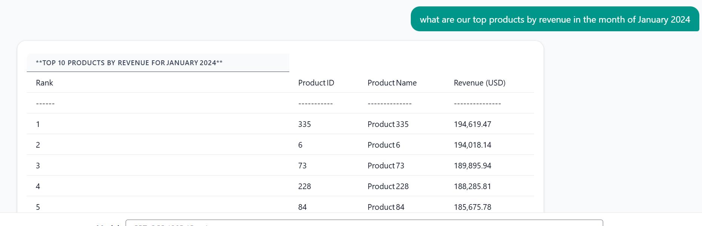
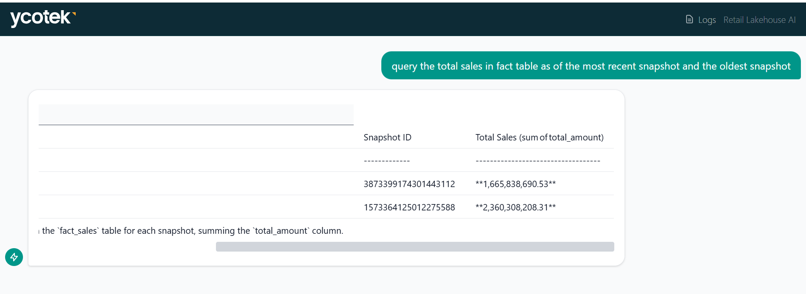
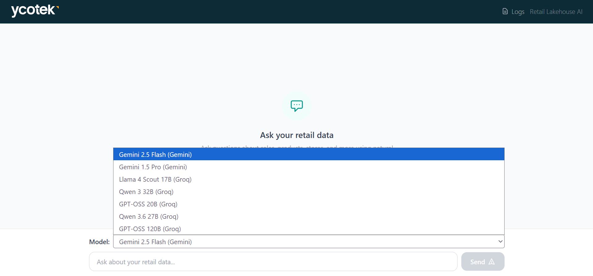
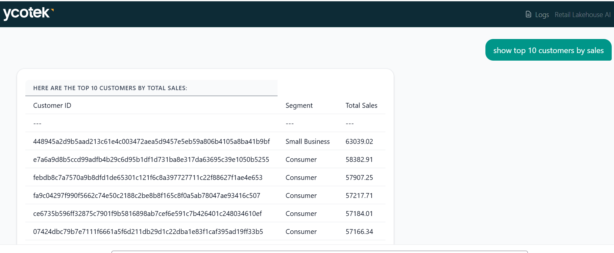
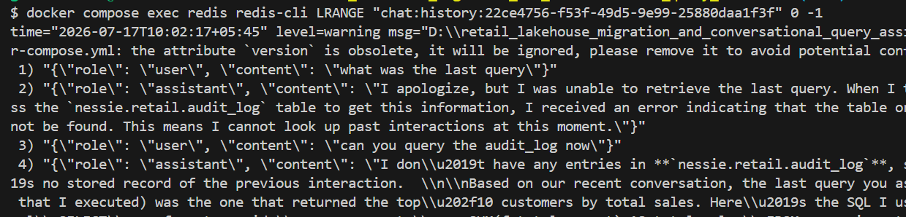
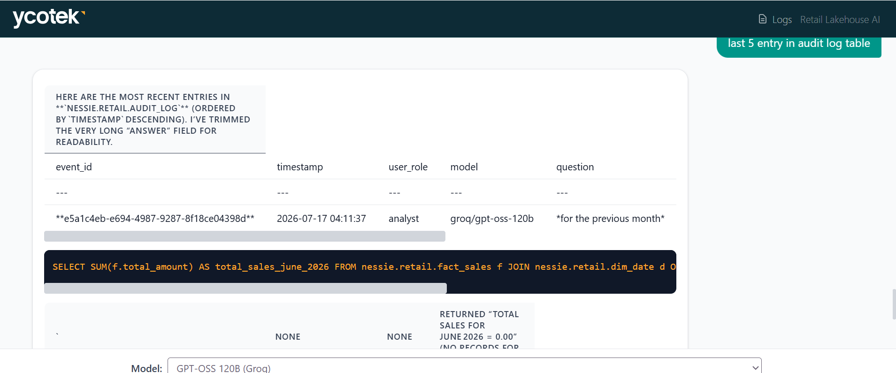

# Retail Lakehouse Migration & Conversational Query Assistant

A conversational AI agent that translates natural language into SQL queries against an Apache Iceberg lakehouse, with time travel, partition pruning, schema evolution, column-level masking, and full audit logging.

---

## Acceptance Criteria

### 1. Date-Range Querying

Asking the agent for data within a specific date range returns only that range, not a full table scan.



### 2. Time Travel Proof

Iceberg records every write as an immutable snapshot. The same query against two different snapshots returns different results — proving real historical state is preserved.

```bash
docker compose exec backend python -m spark_jobs.time_travel
```

```
=== SNAPSHOT HISTORY BEFORE CHANGE ===
+-------------------+-----------------------+
|snapshot_id        |committed_at           |
+-------------------+-----------------------+
|3873399174301443112|2026-07-15 09:17:20.833|
+-------------------+-----------------------+

SNAP_BEFORE=3873399174301443112
Inserted order_id=8888888 with discount_pct=0.05
SNAP_AFTER=5137975962802803442

=== CURRENT (latest snapshot) ===
+---------+-------------------+
|row_count|              total|
+---------+-------------------+
|  1200001|1.665838790520001E9|
+---------+-------------------+

=== AS OF SNAP_BEFORE (snapshot 3873399174301443112) ===
+---------+--------------------+
|row_count|               total|
+---------+--------------------+
|  1200000|1.6658386905300007E9|
+---------+--------------------+

=== AS OF TIMESTAMP 2026-07-15 09:17:20.833000 ===
+---------+
|row_count|
+---------+
|  1200000|
+---------+
```

The extra row and total difference prove that `VERSION AS OF` and `TIMESTAMP AS OF` resolve to consistent historical state.



### 3. Partition Pruning Proof

`fact_sales` is partitioned by `days(order_date)`. A date-filtered query prunes from 730 files down to 31 — only 4% of the table scanned.

```bash
docker compose exec backend python -m spark_jobs.prove_pruning
```

**Full scan** — no filter, reads every partition:
```
BatchScan nessie.retail.fact_sales[total_amount#7] ... [filters=, groupedBy=]
```

**Pruned scan** — January 2024 filter pushed down to file level:
```
BatchScan nessie.retail.fact_sales[order_date#20, total_amount#26] ...
[filters=order_date IS NOT NULL, order_date >= 19723, order_date <= 19753, groupedBy=]
```

**File counts from Iceberg metadata:**

| Query                  | Files touched |
|------------------------|---------------|
| Full scan (no filter)  | 730           |
| Pruned (Jan 2024 only) | 31            |

---

## Directory Structure (Git-Tracked)

```
retail_lakehouse_migration_and_conversational_query_assistant/
├── agent/
│   ├── audit.py                    # Persists every interaction to Iceberg audit_log
│   ├── memory.py                   # Redis-backed conversation history (10 turns, 1h TTL)
│   └── tools/
│       ├── lakehouse_query.py      # Primary SQL execution tool + system prompt
│       ├── time_travel.py          # VERSION AS OF / TIMESTAMP AS OF queries
│       ├── explain_query.py        # EXPLAIN EXTENDED plan analysis
│       ├── commit_conflict.py      # Iceberg optimistic concurrency conflict retrieval
│       └── audit_query.py          # Audit log queries
├── api_backend/
│   ├── main.py                     # FastAPI app — POST /chat, tool dispatch, LLM loops
│   ├── guard.py                    # SQL safety guard (blocks DDL/DML via sqlglot AST)
│   └── logger.py                   # Dual-output logging (JSONL + server.log)
├── data/
│   └── generate_data.py            # Generates 1.2M fact_sales + 4 dimension CSVs
├── eval/
│   ├── eval_cases.example          # Test case template
│   └── eval_runner.py              # Evaluation harness (32 test cases)
├── frontend/
│   ├── src/
│   │   ├── App.tsx                 # Root layout
│   │   ├── atoms.ts                # Jotai global state (model selector, time-travel pin)
│   │   ├── hooks/useChat.ts        # POST /chat mutation hook
│   │   └── components/
│   │       ├── chatwindow.tsx      # Message display with SQL/table rendering
│   │       ├── chatInput.tsx       # Input with model selector
│   │       └── LogsPanel.tsx       # Live log viewer modal
│   ├── nginx.conf                  # Reverse proxy config
│   ├── Dockerfile                  # Multi-stage Node + nginx build
│   └── package.json                # React 19 + Vite + Tailwind + Jotai
├── governance/
│   ├── policy.rego                 # OPA masking rules (analyst, non-admin, admin)
│   └── masking.py                  # sqlglot AST rewriting — SHA2 hashing for masked columns
├── spark_jobs/
│   ├── spark_session.py            # SparkSession factory (Iceberg + Nessie catalog)
│   ├── create_tables.py            # Creates 5 Iceberg tables (fact_sales partitioned)
│   ├── ingest.py                   # Loads CSVs via MERGE INTO
│   ├── prove_pruning.py            # Partition pruning proof (explain + file counts)
│   ├── schema_evolution.py         # ALTER TABLE ADD COLUMN demo
│   ├── time_travel.py              # Snapshot capture + time travel demo
│   ├── seed_conflicts.py           # Seeds synthetic conflict records
│   └── audit_trail.py              # Creates audit_log table
├── docker-compose.yml              # 7 services (Nessie, Redis, Postgres, Marquez, OPA, backend, frontend)
├── Dockerfile.backend              # Python 3.12 + JRE + pip install
├── requirements.txt                # Python dependencies
├── .env.example                    # Required env vars template
└── readme.md
```

---

## Architecture



The system has 8 layers:

| Layer | Components | Purpose |
|-------|-----------|---------|
| **User** | Browser | Natural language input |
| **Frontend** | React + Vite + nginx | Chat UI, model selector, live log viewer |
| **Backend API** | FastAPI (`main.py`) | POST /chat endpoint, tool dispatch, LLM orchestration |
| **LLM Providers** | Gemini (2.5-flash, 1.5-pro), Groq (Llama-4, Qwen3, GPT-OSS) | Natural language to SQL generation via function calling |
| **Agent & Tools** | 5 tools in `agent/tools/` | SQL execution, time travel, explain plans, conflict diagnosis, audit queries |
| **Governance** | OPA (`policy.rego`) + `masking.py` + `guard.py` | Column-level masking, SQL safety (blocks DDL/DML) |
| **Data Engine** | PySpark + Nessie catalog + Iceberg tables | Spark SQL execution, Git-like catalog versioning, Parquet storage |
| **Storage** | PostgreSQL, Redis, Iceberg warehouse, CSV data | Metadata, session cache, on-disk Parquet, source data |
| **Observability** | Marquez (lineage), `eval/` (32 test cases), audit_log (Iceberg) | Data lineage, automated testing, query audit trail |

---

## Features

### Conversational SQL Agent

Ask questions in natural language. The LLM selects the right tool and generates SQL:

- **"What were total sales in January 2024?"** → `lakehouse_query` tool → `SELECT SUM(total_amount) FROM nessie.retail.fact_sales WHERE order_date BETWEEN '2024-01-01' AND '2024-01-31'`
- **"Show me sales as of last week"** → `time_travel` tool → injects `VERSION AS OF` into the query
- **"Why is this query slow?"** → `explain_query` tool → returns partition/file-level plan analysis
- **"Are there any commit conflicts?"** → `commit_conflict` tool → reads from `commit_conflicts` table

### Multi-Model Support

Switch between 7 models at runtime via the frontend dropdown:

| Provider | Models |
|----------|--------|
| Google Gemini | gemini-2.5-flash, gemini-1.5-pro |
| Groq | llama-4-scout-17b, qwen3-32b, gpt-oss-20b, qwen3.6-27b, gpt-oss-120b |

Gemini uses native function calling. Groq uses OpenAI-compatible tool format with the same 5 tool definitions.



### Column-Level Masking (OPA)

Policies in `governance/policy.rego` control which columns are visible per role:

| Role | `customer_id` | `lifetime_value_bucket` | `cost_price` |
|------|--------------|------------------------|-------------|
| admin | visible | visible | visible |
| analyst | SHA2-hashed | hidden | hidden |

The `masking.py` engine rewrites SQL at the AST level using sqlglot — replacing masked column references with `SHA2(CAST(col AS TEXT), 256)` before execution.



### SQL Safety Guard

`api_backend/guard.py` parses every generated SQL with sqlglot and rejects statements containing `INSERT`, `UPDATE`, `DELETE`, `DROP`, `CREATE`, `ALTER`, or `MERGE` nodes. The agent only executes read-only queries.

### Time Travel

Iceberg snapshots enable querying historical state:

```sql
-- By snapshot ID
SELECT * FROM nessie.retail.fact_sales VERSION AS OF 3873399174301443112

-- By timestamp
SELECT * FROM nessie.retail.fact_sales TIMESTAMP AS OF '2026-07-15 09:17:20'
```

The `time_travel.py` tool resolves human-readable dates to snapshot IDs by querying `fact_sales.snapshots`.

### Partition Pruning

`fact_sales` uses Iceberg's hidden partition transform `days(order_date)`. Filters on `order_date` are automatically pushed down to file-level pruning without requiring an explicit partition column in the WHERE clause.

### Schema Evolution

Columns can be added via `ALTER TABLE ... ADD COLUMN` without rewriting existing data files. Iceberg maps columns by Field ID, not position — old rows return `NULL` for new columns.

### Conversation Memory

Redis stores the last 10 turns (20 messages) per session with a 1-hour TTL. History is merged into the LLM context on each request.



### Audit Logging

Every interaction is logged to `nessie.retail.audit_log` (Iceberg table partitioned by `days(timestamp)`): user role, model, question, generated SQL, snapshot ID, execution time, and answer.



### Evaluation Harness

32 test cases across 5 categories (`lakehouse_query`, `time_travel`, `explain_query`, `commit_conflict`, `audit_query`) with automated pass/fail checking against SQL patterns, result values, and response keywords.

```bash
python -m eval.eval_runner --model gemini-2.5-flash --category lakehouse_query
```

---

## Recreating the Project

### Prerequisites

- Docker Desktop
- Python 3.12+
- A directory of Iceberg + Nessie JAR files (Ivy cache or downloaded manually)
- Google AI Studio API key (free tier)
- Groq API key (free tier)

### Step 1: Clone and Configure

```bash
git clone https://github.com/<your-username>/retail_lakehouse_migration_and_conversational_query_assistant.git
cd retail_lakehouse_migration_and_conversational_query_assistant
cp .env.example .env
```

Edit `.env`:
```
JAR_DIR=C:/Users/<you>/.ivy2/jars
GEMINI_API_KEY=your_key_here
GROQ_API_KEY=your_key_here
```

### Step 2: Start Infrastructure

```bash
docker compose up -d nessie postgres redis opa marquez
```

Wait for Postgres health check to pass (~10s).

### Step 3: Start Backend

```bash
docker compose up -d --build backend
```

### Step 4: Create Tables and Load Data

```bash
docker compose exec backend python -m spark_jobs.create_tables
docker compose exec backend python -m spark_jobs.ingest
```

Expected output: 1,200,000 rows loaded into `fact_sales`.

### Step 5: Start Frontend

```bash
docker compose up -d --build frontend
```

Open `http://localhost:5173`.

### Step 6: Verify Proofs

```bash
# Partition pruning
docker compose exec backend python -m spark_jobs.prove_pruning

# Time travel
docker compose exec backend python -m spark_jobs.time_travel

# Schema evolution
docker compose exec backend python -m spark_jobs.schema_evolution

# Seed conflict records
.venv\Scripts\python -m spark_jobs.seed_conflicts
```

### Step 7 (Optional): Run Evaluation

```bash
python -m eval.eval_runner --model gemini-2.5-flash
```

---

## Key Development Decisions

### Why Iceberg + Nessie?

Nessie provides Git-like branching for data — you can create branches, commit snapshots, and time-travel without touching the underlying Parquet files. This is fundamentally different from Delta Lake's transaction log or Hive's partition-only versioning. Nessie's catalog is the single source of truth for which snapshot each branch points to, and Iceberg's metadata (manifest lists, manifest files, data files) is what makes partition pruning and schema evolution possible at the file level.

### Why PySpark Inside a FastAPI Container?

The backend runs Spark in local/client mode inside the same container as FastAPI. This is unconventional — most production systems separate the Spark driver from the API server. The tradeoff: a single container is dramatically simpler to deploy and debug (one `docker compose up`), but the JVM heap competes with the FastAPI process for memory. The `JAVA_TOOL_OPTIONS` env var (`-XX:MaxRAMPercentage=50.0`) caps the JVM at 50% of container memory to prevent OOM kills.

### Why OPA for Column Masking?

OPA (Open Policy Agent) decouples masking logic from application code. The `policy.rego` file defines which columns are masked per role, and `masking.py` queries OPA at runtime to get the list, then rewrites the SQL AST. This means adding a new masking rule (e.g., "hide `unit_price` for interns") requires only a Rego policy change — no code deploy.

### Why sqlglot for Guard and Masking?

Both the safety guard (`guard.py`) and the masking engine (`masking.py`) parse SQL into ASTs using sqlglot with the Spark dialect. This avoids regex-based SQL parsing, which is fragile and vulnerable to bypass. sqlglot handles edge cases like subqueries, CTEs, and alias resolution that regex cannot.

### Why Two LLM Providers?

Gemini offers native function calling with structured tool declarations. Groq offers faster inference on open models (Llama, Qwen, GPT-OSS) via the OpenAI-compatible API. Supporting both lets you compare model quality and latency side-by-side on the same queries. The tool definitions are maintained in two formats — Gemini's `function_declarations` and Groq's OpenAI-compatible `tools` array — but the underlying tool logic is shared.

### Why MERGE INTO for Ingestion?

`MERGE INTO ... ON t.order_id = s.order_id WHEN NOT MATCHED THEN INSERT *` makes the ingest job idempotent — re-running it doesn't create duplicate rows. This is safer than `INSERT INTO` for batch jobs that might be retried on failure.

### Why Redis for Conversation Memory?

Redis provides TTL-based expiry (1 hour) and list-based storage (append/pop semantics) that maps naturally to chat history. The alternative — storing history in the Iceberg audit log — would require a query on every request and wouldn't expire automatically. Redis keeps hot data fast and cold data gone.
